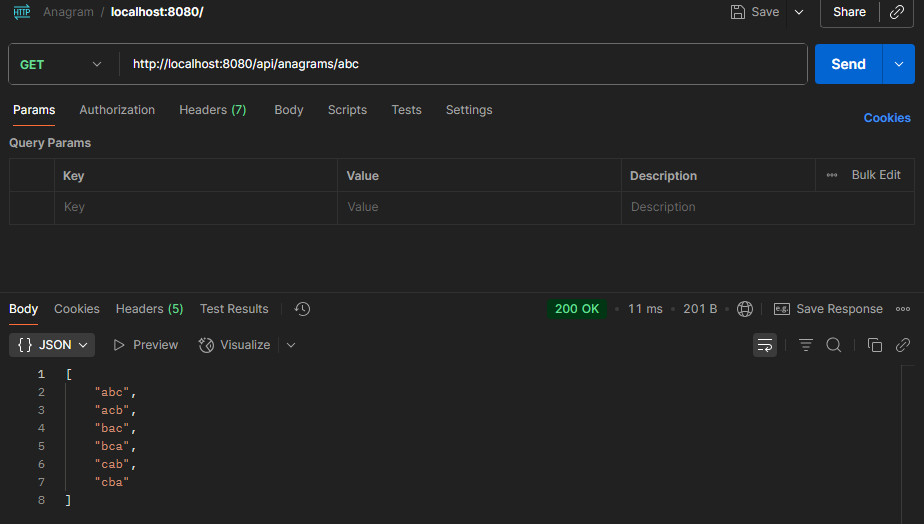
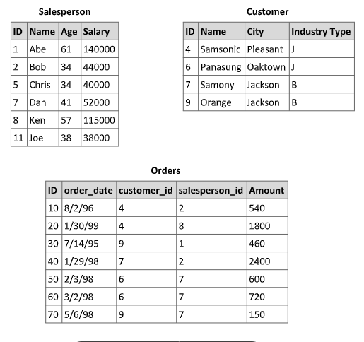
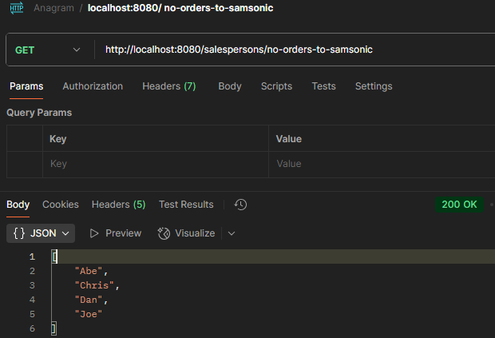
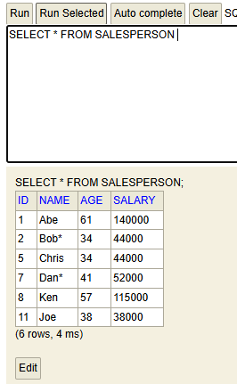

# Anagrans

## Primeira parte

### Gerador de anagrans

#### Write a Java program to solve the following problem:

> You are tasked with creating a utility function for a  
> text-processing application.  
> The function must generate all possible anagrams from a given group of distinct letters.  
> For  example, the input {a, b, c} should return the output: abc, acb, bac, bca, cab, cba.

**Additional Requirements:**

1. The program should accept any group of distinct letters as input and produce the correct result.

2. Optimize for readability and clarity.
3. Include basic validation (e.g., ensure the input is non-empty and contains only letters).
4. Write unit tests to validate your function with at least three different test cases, including edge cases (e.g., input with a single letter or empty input).
5. Document your code clearly, explaining the logic for generating anagrams.

## Segunda parte

### 1. Provide an example scenario where overriding the equals() method is necessary in Java.

> Explain the key considerations when implementing this method, such as  
> ensuring it    aligns with the hashCode() method. Include code  
> examples if possible.

* Exemplo:  Usuario.java

**Pontos-chave ao implementar equals() e hashCode()**

1. Consistência entre equals() e hashCode() .  
   *Se dois objetos são iguais segundo equals(), devem ter o mesmo hashCode().  
   Isso é essencial para coleções como HashSet, HashMap, etc.*

2. Regras do contrato de equals():
- Reflexivo: x.equals(x) deve ser true
- Simétrico: x.equals(y) deve ser igual a y.equals(x)
- Transitivo: se x.equals(y) e y.equals(z), então x.equals(z)
- Consistente: múltiplas chamadas devem retornar o mesmo resultado
- Null-safe: x.equals(null) deve retornar false
- Evite erros comuns:
- Usar == para comparar objetos em vez de .equals()
- Esquecer de sobrescrever hashCode() ao sobrescrever equals()
- Não verificar null ou tipo da classe no equals()

### 2. Explain how you would use a design pattern to decouple your code from a third-party  library that might be replaced in the future.

> Describe the advantages and limitations of    your chosen approach,  
> and provide a small code snippet illustrating its application.

Quando queremos desacoplar nosso código de uma biblioteca externa que pode ser substituída no futuro, um dos padrões mais eficazes é o **Adapter Pattern** (Padrão Adaptador). Ele permite que você crie uma camada intermediária entre sua aplicação e a biblioteca, tornando a substituição futura muito mais simples e segura.

**Por que usar o Adapter Pattern ?**

✅ Vantagens:

-   **Desacoplamento total**: seu código depende de uma interface, não da biblioteca.
-   **Facilidade de substituição**: trocar a biblioteca exige apenas criar um novo adaptador.
-   **Testabilidade**: você pode mockar a interface facilmente em testes.
-   **Organização**: separa a lógica de negócio da lógica de integração.

❌ Limitações:

-   **Sobrecarga de código**: exige criação de interfaces e classes extras.
-   **Manutenção duplicada**: se a biblioteca mudar, o adaptador precisa ser atualizado.
-   **Pode ocultar funcionalidades específicas** da biblioteca se não forem expostas pela interface.

📦 Exemplo prático: envio de e-mail

1. Interface comum da aplicação

        public interface EmailService {  
        void sendEmail(String to, String subject, String body); }  
2. Biblioteca externa (simulada)

       public class ExternalMailer {  
       public void deliver(String recipient, String title, String content)  {
       // lógica de envio real } }  
3. Adaptador que conecta a biblioteca à interface

       public class ExternalMailerAdapter implements EmailService { private  
       final ExternalMailer mailer;        
       public ExternalMailerAdapter(ExternalMailer mailer) {  
           this.mailer = mailer; 
       }
       @Override  
       public void sendEmail(String to, String subject, String body) { 
       mailer.deliver(to, subject, body); } 
       }  
4. Uso na aplicação

       public class NotificationService {  
       private final EmailService emailService; 
       public NotificationService(EmailService emailService) { 
       this.emailService = emailService; 
       } 
       public void notifyUser(String email) { 
       emailService.sendEmail(email, "Bem-vindo!", "Obrigado por se cadastrar.");    
       } }

🔄 Substituindo a biblioteca

Se amanhã você quiser usar outra biblioteca, basta criar um novo adaptador que implemente `EmailService`. Nenhuma outra parte do sistema precisa mudar.

### 3. Describe your experience with Angular, including its core features and use cases.

> Provide an example of a practical application where you used Angular  
> and include a code snippet  demonstrating a key feature, such as  
> component communication, data binding, or  service integration.

🚀 Experiência com Angular    
Minha experiência com Angular envolve a construção de aplicações SPA (Single Page Applications) escaláveis, com foco em performance, modularidade e integração com APIs REST.  
Utilizei Angular em projetos como:
- Sistemas de cadastro com formulários reativos e validação
- Integração com back-end em Java (Spring Boot) usando serviços HTTP

🧩 Recursos principais do Angular
- Componentes: unidades reutilizáveis de UI
- Data Binding: comunicação entre template e lógica (one-way e two-way)
- Services & Dependency Injection: lógica compartilhada e desacoplada
- Routing: navegação entre páginas sem recarregar
- Formulários reativos e template-driven: controle total sobre validação e estado

Vou deixar um link de um projeto que eu estou trabalhando.  
[kata-atende-front](https://github.com/JMarcosMoraes/kata-atende-front)  
[kata-atende-backEnd](https://github.com/JMarcosMoraes/kata-atende)

### 4. Discuss the techniques you use to prevent SQL injection attacks in web applications.

> Provide examples of code showing secure implementations, such as using  
> parameterized  queries or ORMs. Mention any additional measures you  
> take to secure the database  layer.
>
🛡️ Técnicas para Prevenir SQL Injection

1. ✅ **Uso de Queries Parametrizadas (Prepared Statements)**

Essa é a forma mais direta e eficaz de evitar SQL injection. Ao usar parâmetros em vez de concatenar strings, você garante que os dados do usuário não sejam interpretados como comandos SQL.

💡 Exemplo em Java com JDBC

String sql = "SELECT * FROM usuarios WHERE email = ?"; PreparedStatement stmt = connection.prepareStatement(sql); stmt.setString(1, emailInput); ResultSet rs = stmt.executeQuery();  
🔒 _Aqui, mesmo que `emailInput` contenha algo malicioso como `"' OR '1'='1"`, ele será tratado como dado, não como parte da query._

🧠 **Uso de ORMs (Object-Relational Mapping)**

Frameworks como Hibernate, JPA, Sequelize (Node.js), ou Entity Framework (C#) abstraem o SQL e usam mecanismos internos para proteger contra injeções.

💡 Exemplo com JPA (Java)

@Query("SELECT u FROM Usuario u WHERE u.email = :email") Usuario findByEmail(@Param("email") String email);  
✅ _O ORM cuida da parametrização e validação, reduzindo drasticamente o risco de SQL injection._

3. 🔍 **Validação e Saneamento de Entrada**

Embora parametrização seja suficiente na maioria dos casos, validar os dados do usuário ainda é importante:

- Verifique tipos esperados (números, datas, etc.)
- Use expressões regulares para validar formatos (e-mails, CPF, etc.)
- Rejeite entradas com caracteres suspeitos se não forem esperados

4. 🔐 **Privilégios mínimos no banco de dados**

Configure o usuário da aplicação com permissões restritas:

- Sem acesso a comandos perigosos como `DROP`, `ALTER`, etc.
- Sem acesso a tabelas desnecessárias
- Use roles específicas para leitura, escrita e administração

5. 🧰 **Monitoramento e Logging**

- Registre tentativas suspeitas de acesso
- Use ferramentas de WAF (Web Application Firewall)
- Configure alertas para padrões incomuns de querie
6. 🧪 **Testes de Segurança Automatizados**

Utilize ferramentas como:

-   **OWASP ZAP** ou **Burp Suite** para testes de penetração
-   **SonarQube** para análise estática de código
-   **Snyk** ou **Dependabot** para verificar vulnerabilidades em dependência

### 5. Describe the steps you would take to diagnose and improve the performance of a batch  process that interacts with a database and an FTP server.

> Explain how you would identify  bottlenecks, optimize database  
> queries, improve logic execution, and enhance file  transfer  
> efficiency. Provide examples of tools or techniques you would use  
> during the  analysis.
>
🧪 Etapa 1: Diagnóstico — Identificar os Gargalo  
🔍 1. **Mapeamento do fluxo**

- Documente cada etapa: leitura de dados, processamento, escrita no banco, envio/recebimento via FTP.
- Use logs com timestamps para medir o tempo gasto em cada fase.

🧰 2. **Ferramentas de análise**

-   **JProfiler / VisualVM**: para identificar consumo de CPU, memória e threads.
-   **Database EXPLAIN plans**: para analisar queries lentas.
-   **Wireshark / FTP client logs**: para medir latência e throughput de transferências FTP.

🗃️ Etapa 2: Otimização de Banco de Dados

✅ 1. **Use queries parametrizadas**

Evita overhead de parsing e melhora segurança.

PreparedStatement stmt = conn.prepareStatement("SELECT * FROM      pedidos WHERE status = ?"); stmt.setString(1, "pendente");  
🧠 2. **Indexação inteligente**

- Crie índices nas colunas usadas em `WHERE`, `JOIN`, `ORDER BY`.
- Use **EXPLAIN** para verificar se os índices estão sendo utilizados.

🧹 3. **Evite SELECT *** e subqueries desnecessárias**

- Busque apenas os campos necessários.
- Prefira joins otimizados com filtros bem definidos.

🧮 4. **Batch inserts/updates**

Evite operações unitárias. Use transações em lote:

conn.setAutoCommit(false); for (Pedido p : pedidos) { stmt.setInt(1, p.getId()); stmt.setString(2, p.getStatus()); stmt.addBatch(); } stmt.executeBatch(); conn.commit();

⚙️ Etapa 3: Otimização da Lógica de Execução

🧵 1. **Paralelismo e multithreading**

- Divida o processamento em threads ou use `ExecutorService`.
- Exemplo: processar arquivos FTP em paralelo enquanto grava no banco.

🧼 2. **Evite reprocessamentos**

- Marque registros já processados.
- Use cache local ou Redis para evitar consultas repetidas.

🧊 3. **Profiling de código**

- Identifique métodos com maior tempo de execução.
- Refatore loops aninhados e lógica condicional complexa.
- 📤 Etapa 4: Eficiência no FTP

🚀 1. **Use FTP passivo e compressão**

- Compressão (ZIP, GZIP) reduz tempo de transferência.
- FTP passivo evita problemas de firewall.

📦 2. **Transferência em lote**

- Agrupe arquivos pequenos em um único pacote.
- Evite abrir e fechar conexões repetidamente.

🧭 3. **Ferramentas úteis**

-   **Apache Commons Net** ou **JSCH** para FTP/SFTP em Java.
-   **lftp** ou **curl** para testes manuais e automação.

🧠 Etapa 5: Monitoramento e Melhoria Contínua

- Configure **alertas** para tempos de execução fora do padrão.
- Use **Grafana + Prometheus** para visualizar métricas.
- Implemente **retry com backoff exponencial** para falhas de rede.

🧵 Exemplo de Arquitetura Otimizada

    [FTP Download] → [Thread Pool] → [Processamento] → [Batch DB Insert] → [Log & Monitoramento]  

Cada etapa desacoplada, paralelizada e monitorada. Isso reduz o tempo total e melhora a resiliência.

## Modelo de banco de dados:

Given the tables above, write the SQL query that:

- a. Returns the names of all Salesperson that don’t have any order with Samsonic.

- b. Updates the names of Salesperson that have 2 or more orders. It’s necessary to add an  ‘*’ in the end of the name.

Resultado após a chamada do serviço /update-name

- c. Deletes all Ssalesperson that placed orders to the city of Jackson.
- d. The total sales amount for each Salesperson. If the salesperson hasn’t sold anything,  show zero.

7. The customer has a system called XYZ and intends to start updates split into 3 phases.  
   The requirements for the first phase are as follows:
    1. Enable new data entries in the system, which will serve as input for the second  phase.
    2. Implement functionality to create, update, delete, and search plants.
    - Plants should have the following attributes:
        - Code: Numeric only, mandatory, and unique.
        - Description: Alphanumeric, up to 10 characters, optional.  
          o Only admin users can delete plants.

    3. Ensure that the system prevents duplication of plant codes.  
       Task:  
       **Based on the above information:**
        1. Write a use case or user story for this scenario, ensuring that it clearly addresses the  
           requirements.
        2. Highlight any business rules or assumptions relevant to the solution.
        3. Describe any validations or security measures you would implement in the system.
        4. Suggest how you would test this functionality, including examples of edge cases.

8. Consider the following description of a system functionality:
   User Registration
    A screen allows users to insert, delete, or update user information.
    Each user has properties: name, email, address, and phone, where name and email
   are mandatory fields.
    Emails must be unique across all users.
    Only admin users can delete other users.
   Task:
1. Describe the types of tests you would implement (e.g., unit, integration, or end-to-
   end tests) and explain the scenarios you would test to ensure the functionality works
   as expected.
2. Provide examples of edge cases and how you would handle them.
3. Include an example of a test case in code or pseudocode for one or more scenarios.